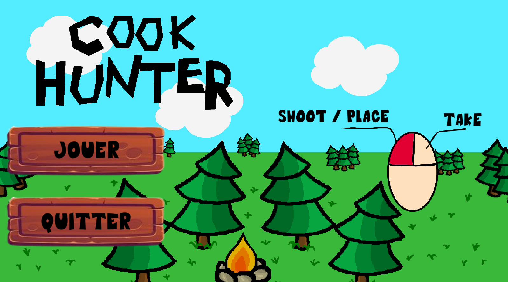

# CookHunter

## Description
Prototype réalisé dans le cadre d'un cours sur le Game Design à Epitech.
### Sujet : Ajouter un Twist à un genre connu
#### Genre choisis : Jeu de gestion de cuisine.
#### Twist choisis : Les ingredients sont vivants il faut les chasser.
#### Types de graphismes : 2D vue de dessus
#### Direction Artistique : Cartoon

## Aperçu

